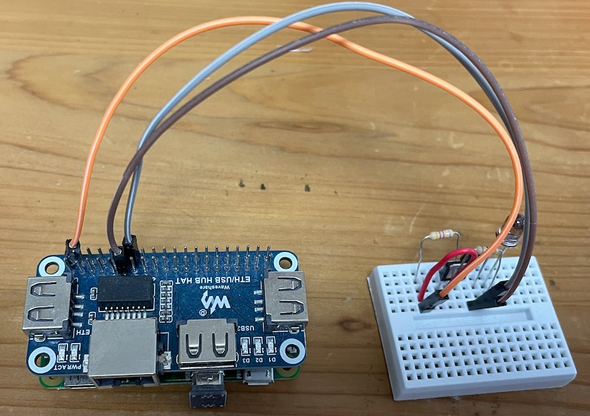
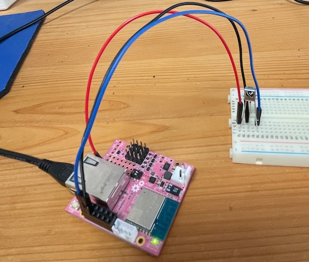
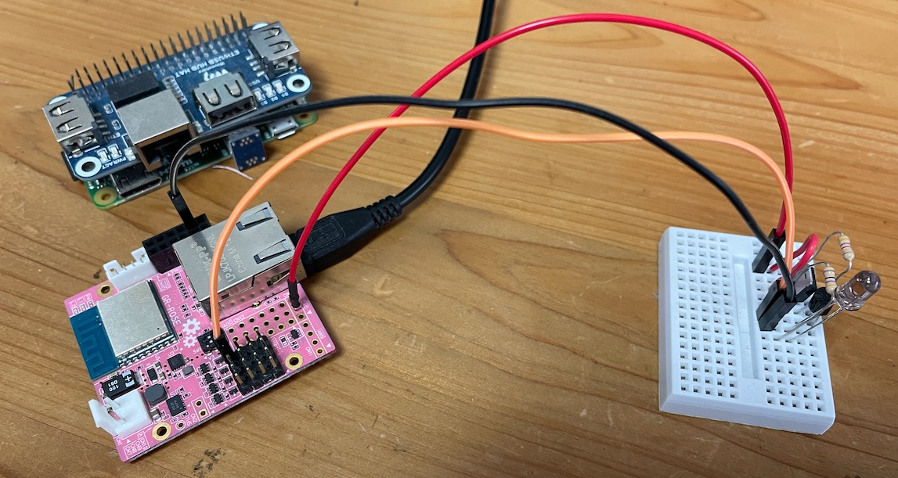
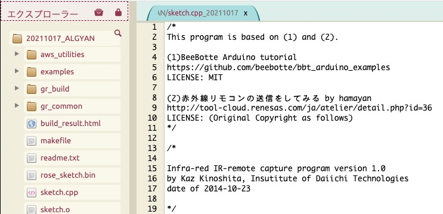

<style type="text/css">
  .reveal h1,
  .reveal h2,
  .reveal h3,
  .reveal h4,
  .reveal h5,
  .reveal h6 {
    text-transform: none;
  }
</style>
# えっ!<br><span style="color:pink">GR-ROSE</span>って<br>　<span style="color:blue">A*m</span>じゃないの？<br>から始めた話

[https://nagahisa.github.io/20211113-algyan/#/](https://nagahisa.github.io/20211113-algyan/#/)

---

## About me

```json: aboutme
aboutme.json
{ 
    "name":　           "Kenzo Nagahisa",
    "twitter":          "@kenzonag",
    "screen_name" :     "けんぞう",
    "interest": [
        {
            "topic":   "電子工作",
            "level":    "全くの初心者"
        },
        {
            "topic":   "Elixir/Nerves",
            "level":    "永遠の初心者"
        }
    ] 
}
```

最近全然サボってますが・・・BLOGも　<br>
[qiita.com/nagahisa](https://qiita.com/nagahisa),
[medium.com/@kenzonag](https://medium.com/@kenzonag)

---

## そもそもの極めて個人的な動機

***
* テレビのリモコンが壊れました orz
* ググって ラズパイゼロでこんなの作りました

---

## 我が家のIoTプロジェクト


参考サイト<br>
[レッツラズパイ！〜Google HomeでLピカさせよう編〜](https://qiita.com/westvirginia/items/47437d547485cd2784ef)<br>
[赤外線LEDドライブ回路の決定版](https://vintagechips.wordpress.com/2013/10/05/%E8%B5%A4%E5%A4%96%E7%B7%9Aled%E3%83%89%E3%83%A9%E3%82%A4%E3%83%96%E5%9B%9E%E8%B7%AF%E3%81%AE%E6%B1%BA%E5%AE%9A%E7%89%88/)

---

 Wifiが不安定なので有線LANもつけました


---

# 結構な不満(^^;
***
* 有線LANボード価格が本体の3倍
* Linux パッチ適用メンドイ
* <span style="color:red">OS起動時にPython動かすって
<br>
...OS要らんやろ</span>
<br>
<br>

## 噂に聞く<span style="color:green">Arduino</span>とかで<br>何とかならんもんか？


---

## なんか無料でトライ<br>出来るらしいぞ
---

```text
「今回、ルネサスエレクトロニクス株式会社様の全面的なご協力のもと、
「がじぇっとるねさすプロジェクトのIoT Edgeデバイス
「GR-ROSE(ジーアール・ローズ)」と周辺部材をどんとご提供頂き、
コンテストを開催する運びとなりました！」
```
[GR-ROSE IoTシステム開発コンテスト meet up！](https://algyan.connpass.com/event/220366/)

---

## "*ROS*"とか"*IoT Edge*"とか<br>謎の呪文があるけど<br><span style="color:green">Arduino</span>って書いてあるし<br>まっ何とかなるか

---


<blockquote class="twitter-tweet"><p lang="ja" dir="ltr"><a href="https://twitter.com/hashtag/ALGYAN?src=hash&amp;ref_src=twsrc%5Etfw">#ALGYAN</a> <a href="https://twitter.com/hashtag/%E3%81%8C%E3%81%98%E3%81%87%E3%82%8B%E3%81%AD?src=hash&amp;ref_src=twsrc%5Etfw">#がじぇるね</a><br>可愛いボードが届きましたー。<br>が、がんばらねば(^^; <a href="https://t.co/FGuDnYXB2c">pic.twitter.com/FGuDnYXB2c</a></p>&mdash; けんぞう (@kenzonag) <a href="https://twitter.com/kenzonag/status/1433687177586638852?ref_src=twsrc%5Etfw">September 3, 2021</a></blockquote> <script async src="https://platform.twitter.com/widgets.js" charset="utf-8"></script>

---

# 「RX65N」搭載

---

## えっ、<span style="color:pink">GR-ROSE</span>って<br>　<span style="color:blue">A*m</span>じゃないの？？

---

# <span style="color:green">Arduino</span>って<br><span style="color:blue">　A*m</span>じゃないの？？


---


---

# と・と・とりあえず<br>頑張ろう

---

# Step.0
---
e2studioに出鼻を挫かれる<br>

---


<blockquote class="twitter-tweet"><p lang="ja" dir="ltr">先日のMeetUpのプログラムがe2studioでビルド成功～<br>公開されたプログラムをインポート後に抜けてるパスを追加したりいくつか変更必要でしたが、みなさんこんなのは楽勝な感じなのでしょうか…🤔←少し手間取った人<br><br>毎日仕事でEclipseをJavaで使っているのでこのIDEは使いやすいです😀<br><br> <a href="https://twitter.com/hashtag/ALGYAN?src=hash&amp;ref_src=twsrc%5Etfw">#ALGYAN</a> <a href="https://t.co/P2NC8gATtn">pic.twitter.com/P2NC8gATtn</a></p>&mdash; しろいとり子 (@siroitori0413) <a href="https://twitter.com/siroitori0413/status/1438843726361554946?ref_src=twsrc%5Etfw">September 17, 2021</a></blockquote> <script async src="https://platform.twitter.com/widgets.js" charset="utf-8"></script>


---

# ううむぅ　
---
色々助けて何とか動いたのですが<br>
・・・<br>
普段Mac使ってるので<br>結局Webコンパイラにしました:p 

---

# Step.1
---
BeeBotte Arduino Tutorialやってみる<br>

[Led Control](https://beebotte.com/tutorials/led_control)

```text
This tutorial presents how Beebotte can be used
 to control a led connected to an Arduino board. 
We will use MQTT protocol to connect Arduino
 to Beebotte to subscribe to messages to turn ON or OFF the led.
```

---

コミュニティに泣きついたり<br>
[WebコンパイラでBeeBotte?](https://japan.renesasrulz.com/gr_user_forum_japanese/f/gr-rose-iot/7493/web-beebotte)

 ArduinoJsonとかの<br>バージョンに悩んだり<br>
 ラジバンダリ<br>
 ・・・
<br>
<br>
 ### 奇跡的に自己解決！


---

# Step.2
----
有線LANにトライする


---

Ethernet単体では動くけど<br>PubSubライブラリが動かない<br>
<br>
今回もコミュニティに泣きついたら<br>
[有線固定IPでMQTT](https://japan.renesasrulz.com/gr_user_forum_japanese/f/gr-rose-iot/7533/ip-mqtt)

---


```text
有線LANでのPubSubClientライブラリ向けのClientクラスの実装は
していません。
MQTTサンプルで以下のインスタンスを作ってますが、
これに相当するEthernetのClientはないです。
すみませんが、EthernetクラスはROS用、AWS用の残骸のようなものなので、
使用できません。
```

###  「ないです」<br>「使用できません」
・・・<br>人生、そう甘くはない


---

有線LANは<br>


---

# Step.3
----
赤外線を受信してみる　


---





---


GR-KURUMIの記事を参考に <br>
[GR-KURUMIの機能を使う 外部割り込み編](http://tool-cloud.renesas.com/ja/atelier/detail.php?id=36)

受信のスケッチ作って<br>TVリモコンで「１、８、電源」を押下
```
 remote control test.
type NEC:sz=4 code:40,bf,01,fe,
type NEC:sz=4 code:40,bf,08,f7,
type NEC:sz=4 code:40,bf,12,ed,
```

我が家のTV電源は<br>「type NEC:sz=4 code:40,bf,12,ed,」<br>を送れば良いみたい

---

# Step.4
----

赤外線を送信してみる


---

### ラズパイで使っていた<br>送信回路をGR-ROSEへ



---

GR-KURUMIの記事を参考に <br>
[GR-KURUMIの機能を使う 外部割り込み編](http://tool-cloud.renesas.com/ja/atelier/detail.php?id=36)

送信のスケッチ作ってループ実行<br>


```
remote control test.
TV on.
TV on.
TV on.
```
TVリモコンはon/off同じ信号なので<br>
TVがオンオフ　

---

# う・う・動いた

---

# 感動です！


---


# Step.5
----

外部割込みで赤外線送信

---

送信信号定義
```C++
// Target IR data.
const unsigned char TVOnOff[] =    {0x40, 0xbf, 0x12, 0xed};
```
setup()でsetCallback
```C++
client.setServer(BBT, 1883);
  // Set the on message callback
  // onMesage function will be called
  // every time the client received a message
  client.setCallback(onMessage);
```
onMessage()でデータ解析してOKなら送信
```C++
  // Send TV-ON
  Serial.println("TV on.");
  irRemocon_txNEC( TVOnOff, sizeof(TVOnOff) );
```


---

# Step.5
----

BeeBotte情報を解析する


---

Google Home→IFTTT→BeeBotte<br>
こんなデータで取得できるので　<br>それを<span style="color:pink">GR-ROSE</span>で解析

```
URL:	https://api.beebotte.com/v1/ゴニョゴニョ
Method:	POST
Content Type:	application/json
Body	:	{“data":[
  {"room":"living","device":"{{TextField}}","action":"on"}]
  }
```

[IFTTTとBeebotteを使ってGoogleHomeからRaspberryPiを操作する](https://qiita.com/msquare33/items/9f0312585bb4707c686b)

---

こんな感じ
```C++
void onMessage(char* topic, byte* payload, unsigned int length) {
  // decode the JSON payload
  StaticJsonDocument<256> doc;

  // Test if parsing succeeds.
  DeserializationError error = deserializeJson(doc, payload);
  if (error) {
    Serial.print(F("deserializeJson() failed: "));
    Serial.println(error.c_str());
    return;
  }
  
  const char* room   = doc["data"][0]["room"];
  const char* device = doc["data"][0]["device"];
  const char* action = doc["data"][0]["action"];

```

---


# Step.5
----
スケッチにまとめました

---

GitHub URL<br>
https://github.com/Nagahisa/20211113-algyan


---

# 大団円
----
感想とお礼

---

# まとめ
***
* ラズパイpythonはコピペで動いてBlackBox
* もし<span style="color:blue">A*m</span>だったら今回も同じでした　
* がじぇるねさん・先人の皆様に感謝
* こんな機会を与えて頂いた小暮さんに大感謝

	<br>今後は<span style="color:pink">GR-ROSE</span>本来の使い方 "*ROS*"にも<br>挑戦したいです(有線LAN使えるみたいだし^^)


---


---

# ちょっと<br>まったぁ〜

---

## 応募要件
---
GR-ROSE＋Azureを使って<br>IoTシステムのアイデアを具現化

---

# Azureを使って

---

# も、もちろん<br>
# 使っておりますとも　
# (大汗)

---

Webコンパイラ: http://tool-cloud2.renesas.com/


→ 13.78.8.20<br>
Azureで動いております　

https://ipgeolocation.io/browse/ip/13.78.8.20

---


---

# おしまい　